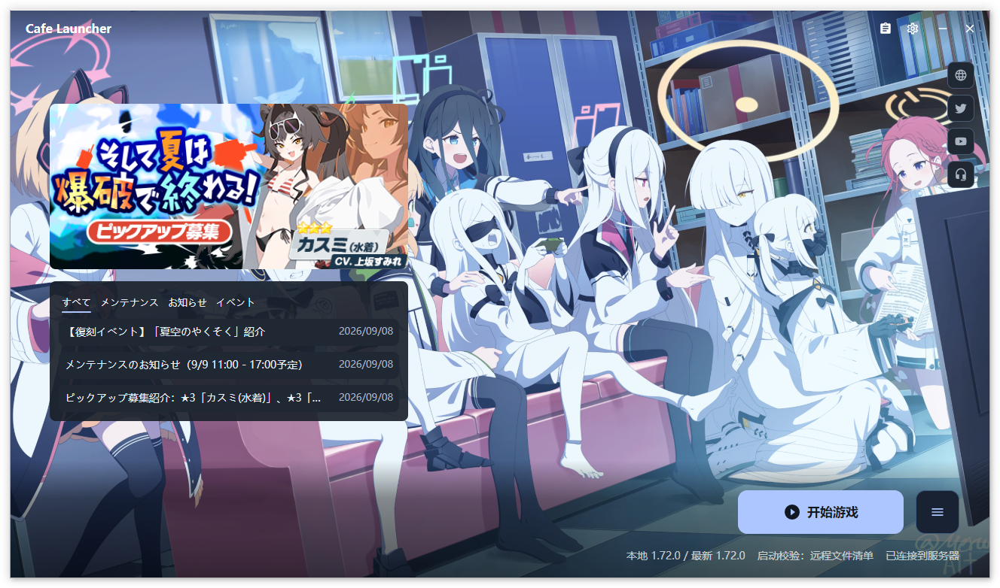

# Cafe Launcher

> Blue Archive 日服桌面启动器 —— 原生体验，实用增强。

[][releases]

[官网](https://bluearchive.cafe/) | [**下载**](#下载与安装) | [**文档**](https://docs.bluearchive.cafe/cafe-launcher/)

> [!IMPORTANT]
> **本仓库即将废弃**。将会开放源代码，后续更新将在主仓库进行。

Cafe Launcher 是由 **蔚蓝咖啡厅 (BlueArchive.Cafe)** 开发的 Blue Archive 日服第三方桌面启动器。基于 .NET 10 + Avalonia 12 构建，原生 Windows 体验。在完整兼容官方启动器游戏数据格式的同时，新增了 CDN 切换、下载可靠性增强、主题定制、崩溃恢复等一系列实用功能。

本项目基于 **Blue Archive 官方 PC 启动器** 的逻辑构建，并在此基础上添加了更多定制化功能，专注于提供原生的桌面启动体验。

> [!NOTE]
> 因开发者本人精力原因，本项目可能不会频繁维护，更新进度会放缓。

---

## 功能特性

### 游戏操作

- **一键安装** — 并行下载 + 断点续传，完成后 CRC64 完整性校验
- **增量更新** — 仅下载变更文件，支持暂停 / 恢复 / 停止
- **修复校验** — 基于 CRC64 的文件完整性修复，最多 3 次重试
- **启动验证** — 三种模式可选（本地清单 / 远程清单 / 跳过），匹配官方启动器的验证逻辑
- **安全卸载** — 仅删除清单内文件，路径遍历防护，游戏进程运行中拒绝卸载

### 下载增强

- 10 线程并行下载，充分利用带宽
- 六档速度限制：无限制 / 1 MB/s / 5 MB/s / 10 MB/s / 25 MB/s / 50 MB/s
- 临时文件机制（`.tmp`），下载完成原子重命名，中断可续传
- CDN 故障自动切换（主 CDN → 备用 CDN）

### CDN 切换

- **官方 CDN** (`official`) — 直连 Yostar 下载服务器
- **Cafe CDN** (`cafe`) — 通过 Cafe 下载源下载，国内速度更快
- 设置中一键切换，即时生效

### 界面与主题

- **主题模式** — 浅色 / 深色 / 跟随系统
- **主题色** — 四种模式：默认蓝 (`#2E7DF6`) / 跟随系统强调色 / 壁纸取色（自动提取调色板） / 自定义颜色
- **背景定制** — 内置默认壁纸 / 远程背景 / 自定义图片；支持填充 / 适应 / 裁剪三种缩放
- **动态效果** — 支持跟随系统、完整动态效果和减少动态效果
- 无边框窗口 + 自定义标题栏，最小化到系统托盘

### 多语言

| 语言 | 覆盖 |
|------|------|
| English | 完整 |
| 简体中文 | 完整 |
| 繁體中文 | 完整 |
| 日本語 | 完整 |

默认跟随系统语言，也可手动切换。

### 远程内容

- 游戏公告、Banner 轮播、资讯卡片
- 社交账号链接
- 可通过设置关闭远程内容卡片

### 资源面板

- 输入玩家 UID，查看、管理汉化资源（文本、语音、图像资源）
- 属于 Cafe 下载源专属功能

### 自我更新

- 默认在启动完成后后台检查更新，也可在设置中关闭
- **稳定版** / **测试版** 双通道；预发布构建默认使用测试版通道
- 优先通过 Cafe 服务查询，失败时回退 GitHub Releases API
- 更新对话框展示发布文件及大小，选择安装包或便携包后使用浏览器下载

### 诊断与恢复

- **崩溃恢复** — 检测上次会话是否异常退出（`session.active` 标记），启动时提示恢复选项
- **统一日志** — 运行与异常统一写入 `unified.log`（Serilog 异步写入；单文件 5 MB，当前文件加 3 份轮转）
- **日志导出** — 一键打包日志为 ZIP，方便反馈问题
- **六级日志** — Verbose / Debug / Information / Warning / Error / Fatal，运行时可切换

### 其他细节

- 可与官方 Yostar 启动器共存，共享游戏文件（`manifest.json` 格式二进制兼容）
- Toast 通知提示，操作结果即时反馈
- 无遥测上报，所有诊断数据保留在本地

---

## 系统要求

| 项目 | 要求 |
|------|------|
| 操作系统 | Windows 10 1809+ / Windows 11 |
| 架构 | x64 |
| 运行库 | 无需额外安装（自包含发布，打包 .NET Runtime） |
| 磁盘空间 | 启动器占用以当前 Release 资产为准；游戏所需空间以向导和设置页检测结果为准 |
| 网络 | 需要互联网连接（下载游戏 + API 通信） |

> **跨平台状态**：当前仅提供 Windows 版本。Linux / macOS 尚未正式支持。

---

## 下载与安装

### 方式一：安装包（推荐）

从 [Releases][releases] 下载最新的 `Cafe.Launcher.Avalonia_v<版本号>_setup.exe`：

1. 运行安装程序，按向导完成安装
2. 默认安装路径：`C:\Program Files\Cafe Launcher`（可自定义）
3. 安装过程需要管理员权限

安装包会自动创建桌面快捷方式和开始菜单条目。后续版本可直接覆盖安装升级。

### 方式二：便携版

从 [Releases][releases] 下载最新的 `Cafe.Launcher.Avalonia_v<版本号>_standalone.zip`：

1. 解压到任意目录
2. 运行 `Cafe.Launcher.Avalonia.exe`

便携版不创建快捷方式。设置、日志和下载状态仍保存在 `%LOCALAPPDATA%\Cafe Launcher\`。

### 更新

启动器默认在初始化完成后后台检查所选频道；检测到新版本时会显示通知。也可点击「设置 → 关于 → 检查更新」，或手动访问 [Releases][releases]。自动检查开关位于「设置 → 常规」。

---

## 使用说明

### 基本流程

1. 首次启动进入五步向导：界面语言 → 下载源 → 游戏路径 → 代理 → 最终复核
2. 左侧导航可返回已完成步骤；复核页可直接点击“修改”返回对应设置
3. 按 `Esc` 或跳过向导时先确认，再应用默认设置
4. 点击主界面 **安装** 按钮，开始下载游戏
5. 安装完成后，点击 **启动** 进入游戏；有更新时按钮自动变为 **更新**

中文系统界面首次默认选择 Cafe 下载源，其他语言环境默认选择官方源；向导中可随时改选。

### 设置参考

点击主界面右上角齿轮图标进入设置，共 6 个分类：

| 分类 | 设置项 |
|------|--------|
| 常规 | 语言（auto / en / zh-Hans / zh-Hant / ja）、关闭行为（最小化到托盘 / 直接退出）、动画效果、启动时检查更新 |
| 游戏 | 游戏路径、启动验证模式（本地清单 / 远程清单 / 跳过）、修复、卸载 |
| 下载与网络 | 代理（自动 / 直连 / 系统代理）、下载源（官方 CDN / Cafe CDN）、速度限制、更新通道（stable / beta） |
| 外观 | 主题（浅色 / 深色 / 跟随系统）、主题色（默认 / 系统 / 壁纸 / 自定义）、背景（内置 / 远程 / 自定义）、状态面板（隐藏 / 简略 / 详细）、远程内容卡片 |
| 高级 | 日志级别、查看日志、导出日志、打开数据目录 |
| 关于 | 版本与构建信息、检查更新、官方网站、GitHub、帮助文档、免责声明 |

Toast 通知始终启用，不再提供独立开关。日志查看器首次显示最新 500 条记录，可继续向前分页；搜索仅作用于已加载记录。

### 数据文件位置

启动器用户数据保存在 `%LOCALAPPDATA%\Cafe Launcher\`：

| 文件 | 说明 |
|------|------|
| `settings.json` | 所有设置项（语言、主题、CDN、速度限制等） |
| `session.active` | 活跃会话标记；异常退出后用于下次启动检测 |
| `unified.log` / `unified_*.log` | 统一运行与异常日志（当前文件加 3 份轮转） |
| `download_state.json` | 下载进度快照，用于断点续传 |
| `shown_notices.json` | 已读公告 ID 列表 |
| `clickCode` | 安装来源追踪标识 |
| `log-exports\` | 日志 ZIP 的默认导出目录（导出时可另选位置） |

`game-launcher-config.json` 和 `manifest.json` 位于设置中指定的游戏目录，用于与官方启动器共享游戏状态。

---

## 常见问题

### 与官方启动器有什么区别？

Cafe Launcher 是独立的第三方启动器，主要差异：

- **技术栈**：.NET 原生应用 vs 官方 Electron 套壳，内存和 CPU 占用更低
- **CDN 切换**：支持 Cafe 下载源，国内下载速度更快
- **中文支持**：简体 / 繁體中文界面（官方仅日文）
- **主题定制**：浅色/深色主题、主题色自定义、壁纸取色
- **无遥测**：官方启动器会上报日志到阿里云 SLS，本启动器完全本地化

### 是否安全？会被封号吗？

Cafe Launcher 不修改游戏客户端、不注入代码，仅提供下载和启动功能。API 认证方式与官方启动器一致（MD5 签名）。截至目前，没有用户因使用本启动器被封号的报告。

### 可以和官方启动器一起用吗？

可以。两个启动器共享 `manifest.json` 和 `game-launcher-config.json`，文件格式完全兼容。你可以在两者之间随时切换。

### 下载太慢怎么办？

1. 设置 → 下载与网络 → 下载源切换为 **Cafe CDN**
2. 确认速度限制为「无限制」
3. 如有代理，在设置中启用系统代理

下载源默认值取决于系统界面语言：中文环境为 Cafe，其他环境为官方。两条线路均可在设置中切换。

### 启动器报错 / 闪退？

1. 重启启动器，崩溃恢复功能会自动检测并提供恢复选项
2. 设置 → 高级 → 日志级别调至 `Debug` 或 `Verbose`，复现问题后导出日志
3. 到 [Issues][issues] 提交反馈，附上导出的日志 ZIP

### 如何彻底卸载？

- **安装包用户**：Windows 设置 → 应用 → Cafe Launcher → 卸载（可选删除用户数据）
- **便携版用户**：直接删除解压目录，手动删除 `%LOCALAPPDATA%\Cafe Launcher\`

---

## 免责声明

版权所有 © 2026 BlueArchive.Cafe。保留所有权利。

"Cafe Launcher" 是由「蔚蓝咖啡厅」开发组开发的第三方 Blue Archive 启动器，与游戏《ブルーアーカイブ》（中文名「蔚蓝档案」）及相关公司并无官方关联。

本软件仅供学习交流使用。使用本软件产生的任何后果由用户自行承担。

Cafe Launcher 为闭源项目，源代码不向公众发布。

[releases]: https://github.com/bluearchive-cafe/Cafe.Launcher.Avalonia_Release/releases
[issues]: https://github.com/bluearchive-cafe/Cafe.Launcher.Avalonia_Release/issues
