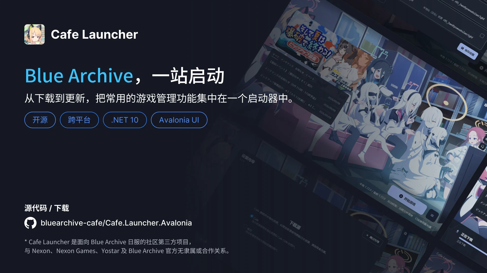
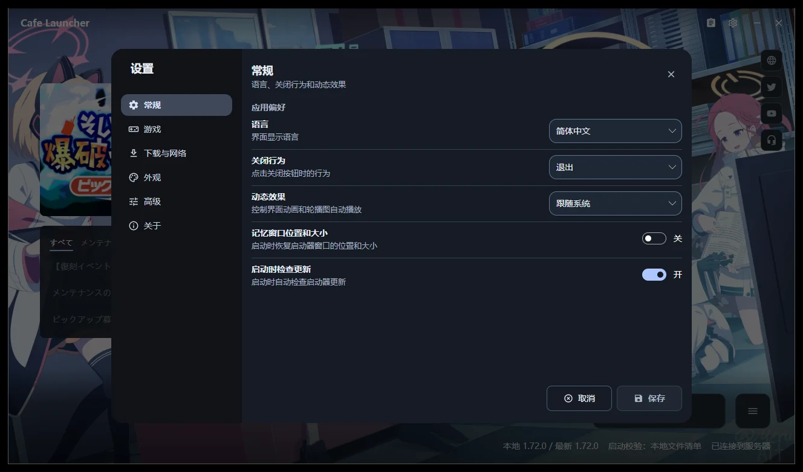
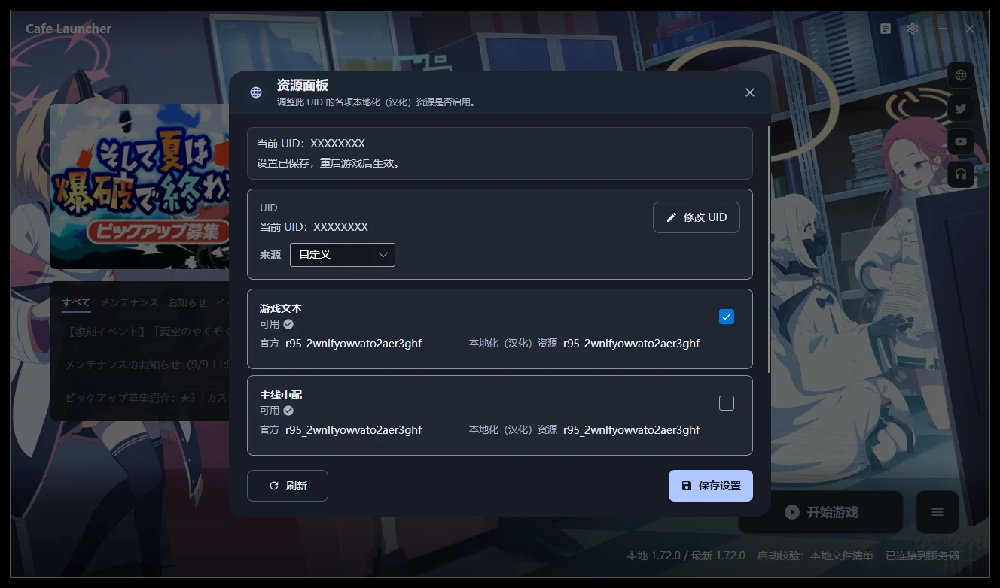
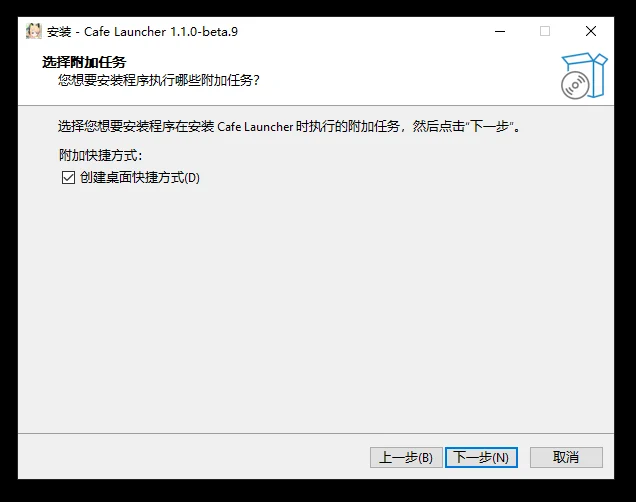

# Cafe Launcher 下载中心

本仓库只用于托管 Cafe Launcher 的版本记录和可下载文件。源代码、开发说明和问题跟踪位于 [Cafe.Launcher.Avalonia](https://github.com/bluearchive-cafe/Cafe.Launcher.Avalonia)，完整使用说明位于[文档站](https://docs.bluearchive.cafe/cafe-launcher/)。

 

[下载最新版本](https://github.com/bluearchive-cafe/Cafe.Launcher.Avalonia_Release/releases) · [安装文档](https://docs.bluearchive.cafe/cafe-launcher/installation) · [常见问题](https://docs.bluearchive.cafe/cafe-launcher/faq) · [提交问题](https://github.com/bluearchive-cafe/Cafe.Launcher.Avalonia/issues)

> [!IMPORTANT]
> Cafe Launcher 是面向 Blue Archive 日服的社区第三方启动器，与 Nexon、Nexon Games、Yostar 及 Blue Archive 官方无隶属或合作关系。请只从本仓库或源码仓库的 Releases 页面下载安装包。

## 选择下载文件

打开 [Releases](https://github.com/bluearchive-cafe/Cafe.Launcher.Avalonia_Release/releases)，进入最新版本后按平台选择资产：

| 平台 | 文件名 | 建议用途 | 支持状态 |
| --- | --- | --- | --- |
| Windows x64 | `Cafe.Launcher.Avalonia_v*_setup.exe` | 带卸载入口和快捷方式的标准安装 | 正式支持 |
| Windows x64 | `Cafe.Launcher.Avalonia_v*_win-x64.zip` | 解压即用的便携版 | 正式支持 |
| macOS Apple Silicon | `Cafe.Launcher.Avalonia_v*_osx-arm64.zip` | 内含 `Cafe Launcher.app` | 实验性 |
| Linux x64 | `Cafe.Launcher.Avalonia_v*_linux-x64.deb` | Debian、Ubuntu 等发行版 | 实验性 |
| Linux x64 | `Cafe.Launcher.Avalonia_v*_linux-x64.AppImage` | 免安装运行 | 实验性 |
| Linux x64 | `Cafe.Launcher.Avalonia_v*_linux-x64.tar.gz` | 手动解压部署 | 实验性 |

文件名中的 `v*` 代表具体版本号。带有 `beta` 的版本属于测试频道；希望获得更稳定体验时，请选择标记为 Latest 且不带预发布标签的版本。

所有发行包均为自包含应用，无需另外安装 .NET Runtime。macOS 与 Linux 版本仍处于实验阶段，功能完整度、系统集成和兼容性可能与 Windows 不同。

## 安装

### Windows 安装版

1. 下载 `setup.exe`。
2. 退出正在运行的 Cafe Launcher。
3. 运行安装程序，先选择安装语言，再按向导确认安装目录与附加任务。
4. 从开始菜单或桌面快捷方式启动 Cafe Launcher。

安装版默认写入 `C:\Program Files\Cafe Launcher`，按所有用户范围安装，因此安装、升级和卸载需要管理员权限。覆盖安装新版本时，游戏文件和用户设置不会被删除。

### Windows 便携版

1. 下载 `win-x64.zip` 并完整解压。
2. 运行 `Cafe.Launcher.Avalonia.exe`。
3. 更新时退出程序，再用新版本替换原便携目录。

不要直接在 ZIP 预览窗口中运行程序。便携版仍会将设置和日志写入 `%LOCALAPPDATA%\Cafe Launcher`。

### macOS

解压 `osx-arm64.zip`，将 `Cafe Launcher.app` 移入“应用程序”后运行。该构建只面向 Apple Silicon Mac，Intel Mac 不在当前发行目标内。

### Linux

- `.deb`：适合 Debian、Ubuntu 及其衍生发行版，可通过系统包管理工具安装。
- AppImage：赋予执行权限后直接运行。
- `tar.gz`：解压后运行其中的 `Cafe.Launcher.Avalonia`。

Linux 桌面仍需系统提供 Avalonia 所依赖的图形、字体和基础运行库。缺少库时，请参考发行版的软件包管理器提示和[安装文档](https://docs.bluearchive.cafe/cafe-launcher/installation)。

## 第一次使用

首次启动会依次引导你选择：

1. 界面语言
2. 下载源
3. 游戏安装路径
4. 代理
5. 确认您的设置

在“确认您的设置”一步可以单独“修改”前四项，确认后点击“完成”应用。完成后，主界面会识别已有游戏或显示“安装游戏”。如果电脑中已经存在官方启动器下载的游戏，请选择同一个 `BlueArchive_JP` 游戏目录，以避免重复下载。

详细说明见[安装与首次使用](https://docs.bluearchive.cafe/cafe-launcher/installation)和[游戏操作](https://docs.bluearchive.cafe/cafe-launcher/operations)。

## 界面预览

主界面在识别到已有游戏后直接给出启动入口，底部状态栏汇总版本、启动校验与网络状态。

设置面板把全部选项分为常规、游戏、下载与网络、外观、高级和关于六类。

使用 Cafe 下载源时，可以用资源面板按 UID 管理游戏文本、主线中配和图像视频三类汉化资源。

Windows 安装程序支持 English、简体中文和日本語，可自定义安装目录与桌面快捷方式。

界面与设置的完整说明见[文档站](https://docs.bluearchive.cafe/cafe-launcher/)。

## 更新、卸载与数据

Cafe Launcher 默认在启动后检查所选更新通道，也可以在“设置 → 关于”手动检查。当前更新流程会打开浏览器下载匹配平台的发行文件，安装仍由用户确认完成。

Windows 安装版可从“设置 → 应用”卸载；便携版删除解压目录即可。卸载启动器不会自动删除游戏目录。设置、下载状态和诊断日志默认保存在 `%LOCALAPPDATA%\Cafe Launcher`，详细保留规则见[卸载与数据](https://docs.bluearchive.cafe/cafe-launcher/uninstall)。

## 遇到问题

请先查看[常见问题](https://docs.bluearchive.cafe/cafe-launcher/faq)。仍无法解决时：

1. 在“设置 → 关于”记录版本和构建信息。
2. 在“设置 → 高级”打开“导出日志”，按需选择时间范围和包含内容后导出 ZIP。
3. 前往[源码仓库 Issues](https://github.com/bluearchive-cafe/Cafe.Launcher.Avalonia/issues)提交复现步骤、截图和日志。

请勿在本 Release 仓库重复提交开发问题。

## 许可与声明

Cafe Launcher 源代码基于 [MIT License](https://github.com/bluearchive-cafe/Cafe.Launcher.Avalonia/blob/main/LICENSE) 发布。

- [隐私政策](https://github.com/bluearchive-cafe/Cafe.Launcher.Avalonia/blob/main/PRIVACY.md)
- [第三方许可](https://github.com/bluearchive-cafe/Cafe.Launcher.Avalonia/blob/main/THIRD-PARTY-NOTICES.md)
- [源代码](https://github.com/bluearchive-cafe/Cafe.Launcher.Avalonia)
